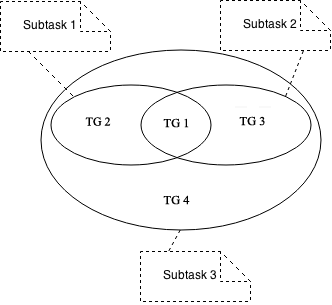

# Tutorial 2: Minimum Spanning Tree

In this tutorial, you will learn how to write a generator for a more complicated problem, called **Minimum Spanning Tree** with test groups. We will focus on the general idea of using test groups in TCFrame.

Here is the complete problem statement:

----

> **Minimum Spanning Tree**
>
> Time Limit: 1 second
>
> Memory Limit: 64 MB
>
> **Description**
>
> Given a weighted, connected graph G consisting of N nodes and M edges. The nodes are numbered from 0 to N - 1. You need to choose N - 1 out of those M edges such that the graph remains connected if we only consider the chosen edges. What is the minimum possible sum of the weight of the chosen edges?
>
> **Input Format**
>
> The first line contains two integers N and M separated by a space.
> M lines follow. Each line contains three integers U, V, and W separated by a space, representing an edge connecting node U and V with weight W.
>
> **Output Format**
>
> A single line containing the minimum possible sum of the weight of the chosen edges.
>
> **Sample Input**
>
> ```
> 3 3
> 0 1 2
> 1 2 3
> 2 0 4
> ```
>
> **Sample Output**
>
> ```
> 5
> ```
>
> **Constraints for all subtasks**
> 
> - 2 ≤ N ≤ 100,000
> - N - 1 ≤ M ≤ 100,000
> - 0 ≤ U, V < N
> - 1 ≤ W ≤ 1,000
> - The graph is connected
> - There is no edge connecting a node to itself
>
> **Subtask 1 (20 points)**
> 
> - M ≤ 20
>
> **Subtask 2 (30 points)**
> 
> - All W are equal
>
> **Subtask 3 (50 points)**
> 
> No additional constraints

----

Since the steps of preparing the problem package and writing the solution are similar to the previous tutorial, we will not cover those steps in this tutorial. Instead, we will focus on writing the problem spec and test spec. Let's use `minimum-spanning-tree` as the slug for this problem.

## Writing problem spec

The following is a problem spec that is derived directly from the problem statement. We are using the same private method `eachElementBetween()` from the previous tutorial. We are adding another private method `allAreEqual()`. We are also adding several private methods for checking graph properties, namely `noSelfLoop()` (self loop is an edge connecting a node to itself) and `isConnected()`. These methods are very modular and we can always reuse them for another problem. However, note that the methods assume the nodes of the graph are 0-based, and several minor changes are needed if the nodes are 1-based.

Let's focus on the syntax differences compared to the first tutorial. Note that we are using the method `Constraints()` to include the global constraints that applies to every subtask, and we are using `SubtaskX()` to include the constraints that apply to only those subtasks. Since `Subtask3()` does not have any additional constraints that are not included in the global constraints, we can simply just leave the method empty.

```cpp title="minimum-spanning-tree/spec.cpp"
#include <bits/stdc++.h>
#include <tcframe/spec.hpp>

using namespace std;
using namespace tcframe;

class ProblemSpec : public BaseProblemSpec {
protected:
    int N, M;
    vector<int> U, V, W;
    int res;

    void InputFormat() {
        LINE(N, M);
        LINES(U, V, W) % SIZE(M);
    }

    void OutputFormat() {
        LINE(res);
    }

    void GradingConfig() {
        TimeLimit(1);
        MemoryLimit(64);
    }

    void Constraints() {
        CONS(2 <= N && N <= 100000);
        CONS(N - 1 <= M && M <= 100000);
        CONS(eachElementBetween(U, 0, N - 1));
        CONS(eachElementBetween(V, 0, N - 1));
        CONS(eachElementBetween(W, 1, 1000));
        CONS(noSelfLoop(U, V));
        CONS(isConnected(N, U, V));
    }

    void Subtask1() {
        Points(20);

        CONS(M <= 20);
    }

    void Subtask2() {
        Points(30);

        CONS(allAreEqual(W));
    }

    void Subtask3() {
        Points(50);
    }

private:
    bool eachElementBetween(const vector<int>& v, int lo, int hi) {
        for (int x : v) {
            if (x < lo || x > hi) {
                return false;
            }
        }
        return true;
    }

    bool allAreEqual(const vector<int>& v) {
        for (int x : v) {
            if (x != v[0]) {
                return false;
            }
        }
        return true;
    }

    bool noSelfLoop(const vector<int>& u, const vector<int>& v) {
        for (int i = 0; i < u.size(); i++) {
            if (u[i] == v[i]) {
                return false;
            }
        }
        return true;
    }

    bool isConnected(int n, const vector<int>& u, const vector<int>& v) {
        vector<bool> isVisited(n);
        vector<vector<int>> adj(n);
        for (int i = 0; i < u.size(); i++) {
            adj[u[i]].push_back(v[i]);
            adj[v[i]].push_back(u[i]);
        }
        int numNodesVisited = 0;
        queue<int> q;
        q.push(0);
        while (!q.empty()) {
            int now = q.front();
            q.pop();
            if (isVisited[now]) {
                continue;
            }
            isVisited[now] = true;
            ++numNodesVisited;
            for (int v : adj[now]) {
                q.push(v);
            }
        }
        return numNodesVisited == n;
    }
};
```

## Writing test spec

The first difference in the `TestSpec` class compared to the first tutorial is in the sample test cases declaration. We need to declare which subtasks will have this sample test case as one of their test cases. For the sample test case in the problem above, since M ≤ 20 and not all W are equal, then the sample test case will be included in subtask 1 and subtask 3.

```cpp title="minimum-spanning-tree/spec.cpp (continued)"
class TestSpec : public BaseTestSpec<ProblemSpec> {
protected:
    void SampleTestCase1() {
        Subtasks({1, 3});
        Input({
            "3 3",
            "0 1 2",
            "1 2 3",
            "2 0 4"
        });
        Output({
            "5"
        });
    }
};
```

The `BeforeTestCase()` has the same syntax compared to the previous tutorial. However, here we need to clear more vectors before every test case.

```cpp
void BeforeTestCase() {
    U.clear();
    V.clear();
    W.clear();
}
```

Before creating the actual test cases, let us create the private helper methods that will help us in creating the actual test cases later. Similar to the private helper methods in `ProblemSpec`, these methods are very modular and we can always reuse them for another problem.

```cpp
void randomWeight(int m, vector<int>& w, int minW = 1, int maxW = 1000) {
    for (int i = 0; i < m; i++) {
        w.push_back(rnd.nextInt(minW, maxW));
    }
}

void renumber(int n, vector<int>& u, vector<int>& v) {
    vector<int> permutation;
    for (int i = 0; i < n; i++) {
        permutation.push_back(i);
    }
    rnd.shuffle(permutation.begin(), permutation.end());
    for (int i = 0; i < u.size(); i++) {
        u[i] = permutation[u[i]];
        v[i] = permutation[v[i]];
    }
}

void randomTree(int n, vector<int>& u, vector<int>& v) {
    for (int i = 1; i < n; i++) {
        u.push_back(i);
        v.push_back(rnd.nextInt(0, i - 1));
    }
    renumber(n, u, v);
}

void randomGraph(int n, int m, vector<int>& u, vector<int>& v) {
    randomTree(n, u, v);
    while (u.size() < m) {
        int newU = rnd.nextInt(0, N - 2);
        int newV = rnd.nextInt(newU + 1, N - 1);
        u.push_back(newU);
        v.push_back(newV);
    }
}
```

Now, let us move on to the creation test cases itself. The actual test cases for a problem involving test groups are challenging. The first step is to draw the Venn diagram of the subtasks.

The properties of the subtasks of the above problem are :

1. All test cases in subtask 1 and subtask 2 are also in subtask 3, and subtask 3 contains some other test cases that are neither in subtask 1 nor subtask 2.

2. Some test cases are in both subtask 1 and subtask 2, and there are also test cases that are in subtask 1 but not in subtask 2, and there are also test cases that are in subtask 2 but not in subtask 2.

Therefore, the Venn diagram looks like this



We need to define a test group for each of the regions in the Venn diagram. Therefore, we will have four test groups. Let us number it from 1 to 4 in the same order as the diagram above. Therefore, the four test groups will have the following constraints in addition to the global constraints:

1. M ≤ 20 and all W are equal
2. M ≤ 20 and not all W are equal
3. M > 20 and all W are equal
4. M > 20 and not all W are equal

For example, the test cases for the first test group can be something like this

```cpp
void TestGroup1() {
    Subtasks({1, 2, 3});

    CASE(N = 2, M = 1, U = {0}, V = {1}, W = {1});
    CASE(N = 21, M = 20, randomTree(N, U, V), W.assign(M, 1000));
    CASE(N = 20, M = 20, randomGraph(N, M, U, V), W.assign(M, 1000));

    for (int i = 0; i < 5; i++) {
        CASE(N = rnd.nextInt(2, 21),
                M = rnd.nextInt(N - 1, 20),
                randomGraph(N, M, U, V),
                W.assign(M, rnd.nextInt(1, 1000)));
    }
}
```

It is a good practice to include the smallest case (M = 1) and the largest case (M = 20) satisfying the test group constraints. Since this test group is also included in subtask 2, we also need to make sure that all W are equal.

The second test group can be something like this

```cpp
void TestGroup2() {
    Subtasks({1, 3});
    
    // We manually create a small test case where greedily choosing
    // the first N - 1 edges with smallest weight will create a cycle.
    CASE(N = 4, M = 4,
            U = {0, 1, 2, 0},
            V = {1, 2, 0, 3},
            W = {1, 1, 1, 2});

    CASE(N = 2, M = 2, U = {0, 1}, V = {1, 0}, W = {1, 2});
    CASE(N = 21, M = 20, randomTree(N, U, V), randomWeight(M, W));

    for (int i = 0; i < 5; i++) {
        CASE(N = rnd.nextInt(2, 21),
                M = rnd.nextInt(N - 1, 20),
                randomGraph(N, M, U, V),
                randomWeight(M, W));
    }
}
```

Since this test group is not included in subtask 2, it must not be the case that W are equal for all elements. Therefore, the smallest case for this test group is M = 2.

The third and fourth test groups can be created in a similar fashion. You can see the complete code containing the test specifications for the next test groups in the following section.

## Putting it all together

Here is the complete spec file for our Minimum Spanning Tree problem.

```cpp
#include <bits/stdc++.h>
#include <tcframe/spec.hpp>

using namespace std;
using namespace tcframe;

class ProblemSpec : public BaseProblemSpec {
protected:
    int N, M;
    vector<int> U, V, W;
    int res;

    void InputFormat() {
        LINE(N, M);
        LINES(U, V, W) % SIZE(M);
    }

    void OutputFormat() {
        LINE(res);
    }

    void GradingConfig() {
        TimeLimit(1);
        MemoryLimit(64);
    }

    void Constraints() {
        CONS(2 <= N && N <= 100000);
        CONS(N - 1 <= M && M <= 100000);
        CONS(eachElementBetween(U, 0, N - 1));
        CONS(eachElementBetween(V, 0, N - 1));
        CONS(eachElementBetween(W, 1, 1000));
        CONS(noSelfLoop(U, V));
        CONS(isConnected(N, U, V));
    }

    void Subtask1() {
        Points(20);

        CONS(M <= 20);
    }

    void Subtask2() {
        Points(30);

        CONS(allAreEqual(W));
    }

    void Subtask3() {
        Points(50);
    }

private:
    bool eachElementBetween(const vector<int>& v, int lo, int hi) {
        for (int x : v) {
            if (x < lo || x > hi) {
                return false;
            }
        }
        return true;
    }

    bool allAreEqual(const vector<int>& v) {
        for (int x : v) {
            if (x != v[0]) {
                return false;
            }
        }
        return true;
    }

    bool noSelfLoop(const vector<int>& u, const vector<int>& v) {
        for (int i = 0; i < u.size(); i++) {
            if (u[i] == v[i]) {
                return false;
            }
        }
        return true;
    }

    bool isConnected(int n, const vector<int>& u, const vector<int>& v) {
        vector<bool> isVisited(n);
        vector<vector<int>> adj(n);
        for (int i = 0; i < u.size(); i++) {
            adj[u[i]].push_back(v[i]);
            adj[v[i]].push_back(u[i]);
        }
        int numNodesVisited = 0;
        queue<int> q;
        q.push(0);
        while (!q.empty()) {
            int now = q.front();
            q.pop();
            if (isVisited[now]) {
                continue;
            }
            isVisited[now] = true;
            ++numNodesVisited;
            for (int v : adj[now]) {
                q.push(v);
            }
        }
        return numNodesVisited == n;
    }
};

class TestSpec : public BaseTestSpec<ProblemSpec> {
protected:
    void SampleTestCase1() {
        Subtasks({1, 3});
        Input({
            "3 3",
            "0 1 2",
            "1 2 3",
            "2 0 4"
        });
        Output({
            "5"
        });
    }

    void BeforeTestCase() {
        U.clear();
        V.clear();
        W.clear();
    }

    void TestGroup1() {
        Subtasks({1, 2, 3});

        CASE(N = 2, M = 1, U = {0}, V = {1}, W = {1});
        CASE(N = 21, M = 20, randomTree(N, U, V), W.assign(M, 1000));
        CASE(N = 20, M = 20, randomGraph(N, M, U, V), W.assign(M, 1000));

        for (int i = 0; i < 5; i++) {
            CASE(N = rnd.nextInt(2, 21),
                    M = rnd.nextInt(N - 1, 20),
                    randomGraph(N, M, U, V),
                    W.assign(M, rnd.nextInt(1, 1000)));
        }
    }

    void TestGroup2() {
        Subtasks({1, 3});
        
        // We manually create a small test case where greedily choosing
        // the first N - 1 edges with smallest weight will create a cycle.
        CASE(N = 4, M = 4,
                U = {0, 1, 2, 0},
                V = {1, 2, 0, 3},
                W = {1, 1, 1, 2});

        CASE(N = 2, M = 2, U = {0, 1}, V = {1, 0}, W = {1, 2});
        CASE(N = 21, M = 20, randomTree(N, U, V), randomWeight(M, W));

        for (int i = 0; i < 5; i++) {
            CASE(N = rnd.nextInt(2, 21),
                    M = rnd.nextInt(N - 1, 20),
                    randomGraph(N, M, U, V),
                    randomWeight(M, W));
        }
    }

    void TestGroup3() {
        Subtasks({2, 3});

        CASE(N = 2, M = 21, randomGraph(N, M, U, V), W.assign(M, rnd.nextInt(1, 1000)));
        CASE(N = 100000, M = 99999, randomGraph(N, M, U, V), W.assign(M, 1000));
        CASE(N = 100000, M = 100000, randomGraph(N, M, U, V), W.assign(M, 1000));

        for (int i = 0; i < 5; i++) {
            CASE(N = rnd.nextInt(2, 100000),
                    M = rnd.nextInt(max(N - 1, 21), 100000),
                    randomGraph(N, M, U, V),
                    W.assign(M, rnd.nextInt(1, 1000)));
        }
    }

    void TestGroup4() {
        Subtasks({3});

        CASE(N = 2, M = 21, randomGraph(N, M, U, V), randomWeight(M, W));
        CASE(N = 100000, M = 99999, randomGraph(N, M, U, V), randomWeight(M, W));
        CASE(N = 100000, M = 100000, randomGraph(N, M, U, V), randomWeight(M, W));

        for (int i = 0; i < 5; i++) {
            CASE(N = rnd.nextInt(2, 100000),
                    M = rnd.nextInt(max(N - 1, 21), 100000),
                    randomGraph(N, M, U, V),
                    randomWeight(M, W));
        }
    }

private:
    void randomWeight(int m, vector<int>& w, int minW = 1, int maxW = 1000) {
        for (int i = 0; i < m; i++) {
            w.push_back(rnd.nextInt(minW, maxW));
        }
    }

    void renumber(int n, vector<int>& u, vector<int>& v) {
        vector<int> permutation;
        for (int i = 0; i < n; i++) {
            permutation.push_back(i);
        }
        rnd.shuffle(permutation.begin(), permutation.end());
        for (int i = 0; i < u.size(); i++) {
            u[i] = permutation[u[i]];
            v[i] = permutation[v[i]];
        }
    }

    void randomTree(int n, vector<int>& u, vector<int>& v) {
        for (int i = 1; i < n; i++) {
            u.push_back(i);
            v.push_back(rnd.nextInt(0, i - 1));
        }
        renumber(n, u, v);
    }

    void randomGraph(int n, int m, vector<int>& u, vector<int>& v) {
        randomTree(n, u, v);
        while (u.size() < m) {
            int newU = rnd.nextInt(0, N - 2);
            int newV = rnd.nextInt(newU + 1, N - 1);
            u.push_back(newU);
            v.push_back(newV);
        }
    }
};
```

That's it! The complete source files for this tutorial can also be found [here](https://github.com/tcframe/tcframe-examples/tree/master/tutorials/2_minimum-spanning-tree).
